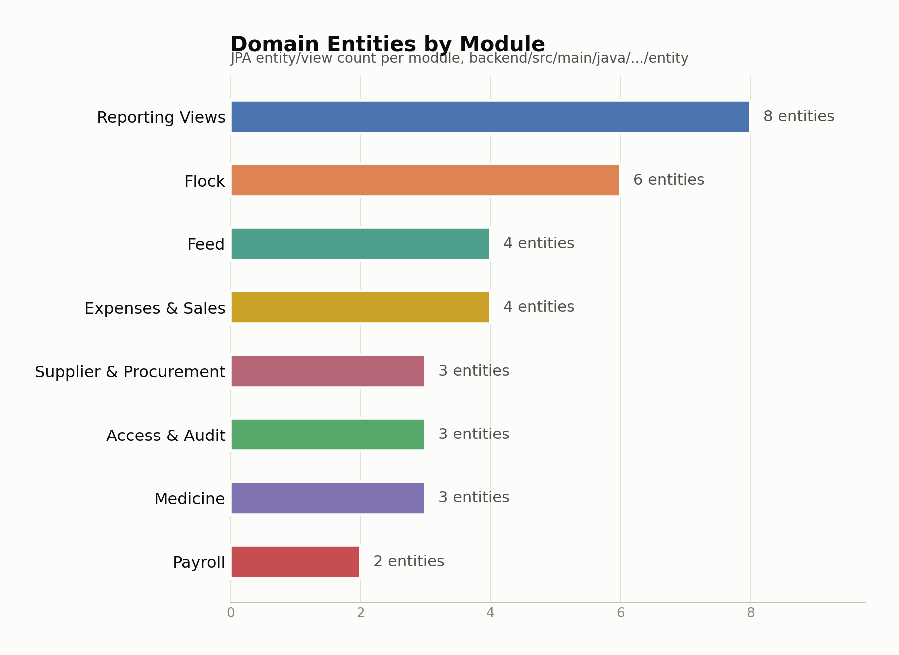
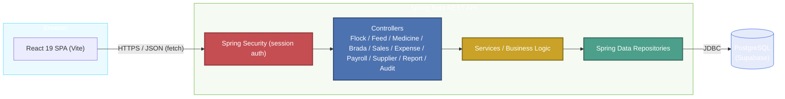
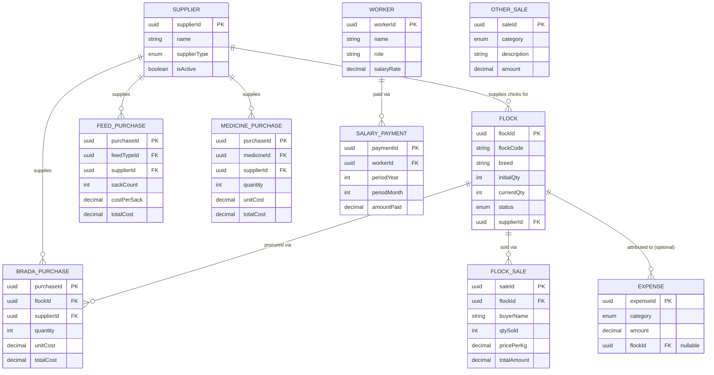

<div align="center">

# CSMS
### Chicken Shed Management System

A full-stack web application for managing day-to-day operations of a poultry farm — from chick procurement through to sale, covering feed, medicine, payroll, expenses, and financial reporting.

[](#tech-stack)
[](#tech-stack)
[](#tech-stack)
[](#tech-stack)
[](#license)

</div>

---

## Tech Stack

| Layer     | Technology                      |
|-----------|---------------------------------|
| Frontend  | React 19, Vite                  |
| Backend   | Spring Boot 3, Java 21          |
| Database  | PostgreSQL (hosted on Supabase) |
| Auth      | Spring Security (session-based) |
| Testing   | JUnit 5, Mockito                |

---

## Project at a Glance

<div align="center">
<picture>
  <source media="(prefers-color-scheme: dark)" srcset="docs/charts/entities-by-module-dark.png">
  
</picture>
</div>

## Architecture

The frontend is a single-page React app that talks to a Spring Boot REST API, which in turn persists through a layered service/repository stack onto a PostgreSQL database hosted on Supabase.



> A live PostgreSQL instance is required. Connection details (URL, username, password) are configured in `backend/src/main/resources/application.properties` — no credentials are reproduced here or anywhere in this README.

---

## Data Model

Core entities and their relationships (simplified — the full schema also includes lookup/audit tables such as `FeedType`, `Medicine`, `Worker`, `User`, `DailyMortality`, `WeeklyWeight`, and reporting views).



---

## Features

| Module | Description |
|--------|-------------|
| **Flock Management** | Register flocks, track status (active/closed), log daily mortality and weekly weights (`/api/flocks`) |
| **Feed Management** | Record feed purchases, daily usage per flock, and surplus sack sales; live stock counter maintained by a DB trigger (`/api/feed`, `/api/feed-types`) |
| **Medicine Management** | Track medicine inventory, purchases per supplier, and usage per flock |
| **Brada (Chick) Procurement** | Log chick purchases linked to a flock at placement (`/api/brada`) |
| **Sales** | Record flock sales (birds sold by weight/price-per-kg) and miscellaneous other sales (`/api/sales`, `/api/other-sales`) |
| **Expenses** | Categorised expense tracking, per-flock or farm-wide (`/api/expenses`) |
| **Payroll** | Manage workers and process monthly salary payments (`/api/payroll`, `/api/workers`) |
| **Supplier Directory** | Maintain supplier records for feed, medicine, and chick suppliers (`/api/suppliers`) |
| **Reports** | Profit/loss per flock, FCR (Feed Conversion Ratio), mortality report, resource consumption summary, and global P&L (`/api/reports`) |
| **Audit Log** | Immutable log of all write operations for traceability (`/api/audit`) |
| **Role-based Access** | ADMIN and WORKER roles with per-endpoint access control via Spring Security |

---

## Prerequisites

- Java 21+
- Maven (or use the included `mvnw` wrapper — no install needed)
- Node.js 18+ and npm
- A running PostgreSQL database (connection configured via `application.properties` — see note above)

---

## How to Run

### 1. Backend

```powershell
cd backend
.\mvnw.cmd spring-boot:run
```

The API starts on **http://localhost:8080**.

> The database connection is configured in `src/main/resources/application.properties`. To use your own PostgreSQL instance, update `spring.datasource.url`, `username`, and `password` there.

### 2. Frontend

```powershell
cd frontend
npm install
npm run dev
```

The app opens on **http://localhost:5173** (Vite default).

> If the backend runs on a different port, update the proxy in `frontend/vite.config.js`.

---

## Running the Tests

Unit tests (Mockito-based, no database required):

```powershell
cd backend
.\mvnw.cmd test "-Dtest=FlockControllerTest,WhiteBoxTests" "-DfailIfNoTests=false"
```

All tests including integration tests (requires the database to be reachable):

```powershell
cd backend
.\mvnw.cmd test
```

---

## Project Structure

```
csms/
├── backend/          # Spring Boot REST API
│   └── src/
│       ├── main/java/com/csms/csms/
│       │   ├── controller/   # REST endpoints
│       │   ├── entity/       # JPA entities & DB views
│       │   └── repository/   # Spring Data repositories
│       └── test/             # JUnit 5 + Mockito test suites
└── frontend/         # React + Vite SPA
    └── src/
        ├── legacy/   # Core UI (HTML/JS extracted into React shell)
        └── App.jsx
```
